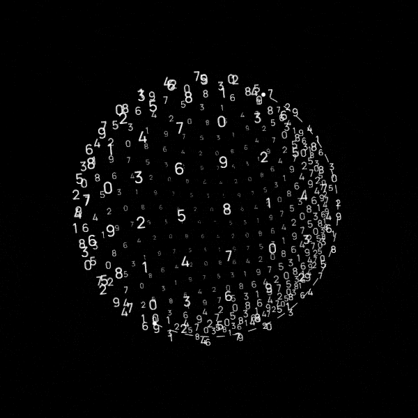

## 📌 About Me

- 🎓 CSE Undergraduate Student
- 💻 Full Stack Developer (MERN)
- 🌱 Currently learning **Django & Python**
- 🚀 Building impactful tech projects
- 🧠 Passionate about Problem Solving
- ⚡ Love exploring modern technologies

## 🧠 My Focus Areas
- Web Development | Tech Learn | Open Source Contribution

## 📊 GitHub Stats 

  
  

## 🛠️ Languages | Framework | Tools

  &nbsp;
  &nbsp;
  ;
  &nbsp;
  &nbsp;
  &nbsp;
  ;
  &nbsp;
  &nbsp;
  ;
  &nbsp;
  &nbsp;
  ;
  &nbsp;
  &nbsp;
  &nbsp;
  

  

## 🔗 Connect with Me

  

